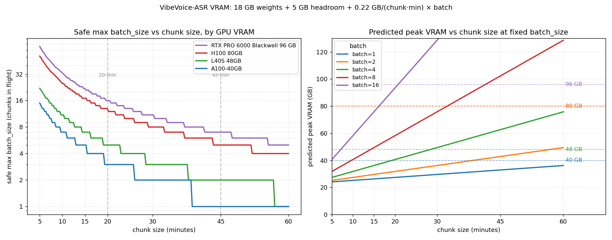
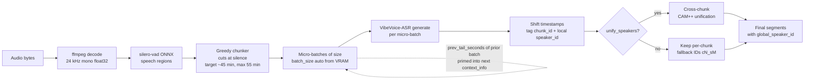
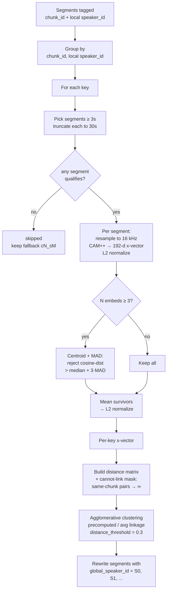

# modal-vibevoice

Production-ready [Modal](https://modal.com) deployment of Microsoft's
**[VibeVoice-ASR](https://huggingface.co/microsoft/VibeVoice-ASR)**, a 9B
unified ASR + diarization + timestamping model with native support for 50+
languages and audio up to 60 min in a single pass.

This deployment adds the engineering you need around the model:

- **Long-form path** (multi-hour audio) via VAD-aware chunking
- **Cross-chunk speaker unification** with a CAM++ x-vector (VoxCeleb,
  language-agnostic)
- **Hotword / context priming** (`context_info`) wired through every entry point
- **Auto batch sizing** based on the GPU's live VRAM
- **Multi-GPU benchmarked**: H100, A100-80, A100-40, RTX PRO 6000

---

## Quick start

```bash
# 1. install the local CLI deps (only `modal` is needed)
uv sync

# 2. authenticate once (skip if already done)
uv run modal token new

# 3. run the test script: builds the image, downloads weights to a persistent Volume, then transcribes
uv run modal run app.py --audio-path test.mp3
```

The first run builds the image (~3 min) and downloads the 18 GB of weights
into the `vibevoice-hf-cache` Modal Volume. **Subsequent cold starts load
weights from the Volume in ~2-7 s.**

To deploy as a long-running service with an HTTP endpoint:

```bash
uv run modal deploy app.py
```

The output prints the public web URL of the `VibeVoiceASR.web` endpoint
(`https://<workspace>--vibevoice-asr-vibevoiceasr-web.modal.run`).

---

## Performance (measured)

All numbers from a single 57.92-minute Mandarin interview (`test.mp3`,
3475 s, mono, 24 kHz). Pipeline: `transcribe_long`, 3 chunks of ~20 min,
batch=auto, speaker unification via CAM++.

| GPU                              | VRAM  | batch* | Peak alloc | Generate | Wall  | RTF (e2e) | Speedup | $/h    | $/job  |
|----------------------------------|------:|-------:|-----------:|---------:|------:|----------:|--------:|-------:|-------:|
| **RTX PRO 6000 Blackwell**       | 96 GB | 3      | 27 GB      | **196 s**| 298 s | **0.065** | **15.3×** | $3.03 | **$0.25** |
| H100 80GB HBM3                   | 80 GB | 3      | 27 GB      | 224 s    | 358 s | 0.076     | 13.1×    | $3.95 | $0.39 |
| A100-80GB PCIe                   | 80 GB | 3      | 27 GB      | 278 s    | 402 s | 0.094     | 10.7×    | $2.50 | $0.28 |
| A100-SXM4 40GB                   | 40 GB | 1      | 20 GB      | 526 s    | 653 s | 0.164     | 6.1×     | $2.10 | $0.38 |

*Effective batch size. Auto-picked from VRAM; capped by the 3 chunks this
audio splits into. Longer audio pulls batch up to the safe cap listed below.

> **RTX PRO 6000 Blackwell** is fastest *and* cheapest per job. Output is
> GPU-invariant (segments, speaker labels, text reproduce verbatim across
> all four GPUs).

---

## VRAM model and auto batch sizing

Empirically calibrated (against a 3.86-hour run on RTX PRO 6000 with 5×45-min
chunks peaking at 59 GB allocated / 87 GB reserved):

```
peak_vram(GB) ≈ 18 (weights) + 5 (headroom) + 0.22 × chunk_minutes × batch_size
```

`batch_size=0` (the default) picks the largest safe value at runtime via
`pynvml`. Override by passing any positive int.

Max safe `batch_size` per GPU per chunk size:

| GPU                              | 10 min | 20 min | 30 min | 45 min | 55 min |
|----------------------------------|-------:|-------:|-------:|-------:|-------:|
| RTX PRO 6000 Blackwell (96 GB)   |     33 |     16 |     11 |      7 |      6 |
| H100 / A100-80 (80 GB)           |     25 |     12 |      8 |      5 |      4 |
| L40S (48 GB)                     |     11 |      5 |      3 |      2 |      2 |
| A100-40GB (40 GB)                |      7 |      3 |      2 |      1 |      1 |

Curve plot in [`assets/vram_curves.png`](./assets/vram_curves.png);
regenerate with:

```bash
uv run --with matplotlib python scripts/plot_vram.py
```



---

## Selecting a GPU

```bash
MODAL_GPU=RTX-PRO-6000 uv run modal run app.py::long --audio-path test.mp3
MODAL_GPU=H100         uv run modal run app.py::long --audio-path test.mp3
MODAL_GPU=A100-80GB    uv run modal run app.py::long --audio-path test.mp3
MODAL_GPU=A100-40GB    uv run modal run app.py::long --audio-path test.mp3
```

Default is `RTX-PRO-6000` (fastest *and* cheapest per job on the measured
workload). The chosen value is read once at module import, so
`modal deploy` will pin the deployment to the GPU set at deploy time.

---

## Entrypoints

The app exposes three local entrypoints and an HTTP endpoint.

### `main`: single short audio (≤ 60 min)

```bash
uv run modal run app.py --audio-path clip.wav \
  --context-info "Domain: medical conference; Speakers: Dr. Lin, Dr. Chen" \
  --num-beams 1
```

### `bench`: single audio with full GPU instrumentation

```bash
uv run modal run app.py::bench --audio-path test.mp3
```

Reports decode/preprocess/generate split, RTF, tokens/s, peak alloc, peak
reserved, GPU utilization (mean / p50 / p95 / max), and memory-bandwidth
utilization sampled every 500 ms via `pynvml`.

### `long`: arbitrarily long audio (multi-hour)

```bash
# --batch-size 0 = auto-pick from VRAM (default)
uv run modal run app.py::long --audio-path 6h_recording.wav \
  --chunk-target-min 45 --chunk-max-min 55 \
  --batch-size 0 \
  --context-info "Speakers: 主持人, 受訪者; Keywords: 機票, 住宿" \
  --unify-distance-threshold 0.3 \
  --out-json result.json
```

**Pipeline**



1. Decode → 24 kHz mono float32; silero-vad finds speech regions.
2. Greedy chunker cuts at silence near `chunk_target_min`, never above
   `chunk_max_min`.
3. Chunks generated in micro-batches with shared `context_info`; the
   previous batch's last `prev_tail_seconds` of transcription is injected
   as a continuity prime.
4. Per-chunk timestamps shifted, per-chunk speaker IDs tagged.
5. WeSpeaker CAM++ x-vector (VoxCeleb) + agglomerative cosine clustering
   re-labels speakers globally as `S0`, `S1`, ... across the whole audio.

### `/transcribe` and `/transcribe_long` HTTP endpoints

Multipart upload, all CLI parameters mapped to form fields.

```bash
curl -X POST "$ENDPOINT/transcribe_long" \
  -F audio=@6h_recording.wav \
  -F context_info="Domain: ..." \
  -F chunk_target_s=2700 \
  -F chunk_max_s=3300 \
  -F batch_size=0 \
  -F unify_speakers=true \
  -F unify_distance_threshold=0.3
```

Returns the same JSON object as the `long` entrypoint.

---

## Hotwords / context priming

VibeVoice-ASR's `context_info` is a **prompt-level bias** rendered into the
model's input as

```
This is a {duration:.2f} seconds audio, with extra info: {context_info}
Please transcribe it with these keys: ...
```

It is **not** a hard dictionary; incorrect hints don't degrade quality
(verified: passing "KTV equipment" hints on a travel-platform interview
still produced correct transcription with "KKday", "Trip.com", "Klook").

Useful contents:

- Domain / topic: `Domain: KKday/Klook UX research interview`
- Speaker names: `Speakers: 主持人, 受訪者, 訪談員`
- Glossary / hotwords: `Keywords: 機票, 住宿, 行程, 比價`
- For long-form: the previous chunk's tail is auto-prepended as
  `Continued from previous segment: ...`

---

## Cross-chunk speaker unification

VibeVoice's diarization is **only locally consistent** within a single
chunk. For multi-chunk jobs we cluster x-vectors across chunks with
**WeSpeaker CAM++ (VoxCeleb)** (`wespeaker_en_voxceleb_CAM++.onnx`, runs
on CPU via sherpa-onnx, ~7 MB). CAM++ embeddings are language-agnostic
in practice.



Per-segment embedding + MAD outlier rejection avoids two pitfalls of a
naïve concat-then-embed: (1) splice boundaries from non-contiguous audio
distort the x-vector, (2) one mislabelled segment can't drag the whole
key's embedding.

**Cannot-link constraint**: per-segment averaging compresses the embedding
distance distribution (the channel/recording signature survives averaging
while utterance-level variation is averaged out), so different speakers
inside the same chunk can end up only ~0.2 apart. To stay adaptive without
needing a tighter threshold, we lean on what VibeVoice already knows:
within a chunk, different `local_speaker_id`s are different people. We
flood those pairwise distances to infinity before clustering, so any
average-linkage merge spanning such a pair is rejected. A speaker that
truly appears in only one chunk (the short cameo in `test.mp3`) stays an
isolated cluster because every merge attempt with an existing cluster
crosses a same-chunk different-local boundary.

Returned `result["unify"]`:

- `num_global_speakers`, `cluster_sizes`
- `mapping`: `(chunk_id, local_speaker_id) → global_speaker_id`
- `keys`: per-key diagnostics (`num_segments_embedded`,
  `num_segments_rejected`, `used_audio_s`)
- `skipped`: keys with no segment ≥ 3s (`total_audio_s`, `max_segment_s`
  explain why)
- `distance_matrix`: full pairwise cosine distances for threshold tuning
- `speaker_embeddings` (on by default; pass `return_speaker_embeddings=False`
  to skip): processed per-key 192-d x-vectors grouped by `global_speaker_id`;
  a speaker found in N chunks contributes N entries, each tagged with its
  `chunk_id` and `local_speaker_id`

**Tuning**: `unify_distance_threshold` — lower → more clusters (over-split
risk); raise for very similar voices. On the Mandarin `test.mp3`, 0.3
cleanly separates 3 speakers with intra-cluster 0.05–0.17 vs inter-cluster
≥ 0.32.

**Swapping models**: for Mandarin-heavy audio use
`3dspeaker_speech_campplus_sv_zh-cn_16k-common.onnx` (wider margin:
intra ≤ 0.15, inter ≥ 0.48). Any ONNX embedding model from
[sherpa-onnx](https://github.com/k2-fsa/sherpa-onnx/releases/tag/speaker-recongition-models)
(WeSpeaker ResNet34, NeMo TitaNet, 3D-Speaker ERes2Net, …) is a drop-in
swap via `SPEAKER_MODEL_URL` + `SPEAKER_MODEL_PATH` in `config.py`.

---

## Optimizations applied

The design choices behind the **0.065 RTF / 15.3× realtime** headline on
RTX PRO 6000:

| Optimization                                                   | Win |
|----------------------------------------------------------------|-----|
| `flash_attention_2` + bf16 + TF32 + cuDNN benchmark            | baseline for H100-class cards |
| NGC PyTorch 25.12 base image (flash-attn prebuilt)             | clean install, no from-source flash-attn build |
| 1-second silence warm-up in `@modal.enter`                     | no first-call autotune cost |
| Persistent `vibevoice-hf-cache` Volume + `hf_transfer`         | 2–7 s cold weight load vs 60+ s |
| VAD-aware chunking instead of fixed cuts                       | preserves utterance boundaries across chunks |
| Batched chunks (3 in parallel)                                 | **2.2× faster generate** vs sequential |
| Auto-batch from live VRAM                                      | uses every spare byte on the allocated GPU |
| CAM++ via sherpa-onnx (CPU)                                    | speaker unify costs no GPU time |

Things we **deliberately skipped** to preserve quality:

- FP8 / INT8 / INT4 quantization
- Speculative decoding (no suitable draft model for VibeVoice's audio encoder)
- vLLM (negligible single-stream gain on this autoregressive workload)

---

## Layout

```
app.py                      Modal app: image, class, methods, entrypoints
client.py                   Minimal stdlib HTTP client example
pyproject.toml              Local dev deps (just modal)
uv.lock
README.md
LICENSE
scripts/
  benchmark.py              Multi-GPU sweep; emits per-GPU JSON + a
                            markdown comparison report
  plot_vram.py              Regenerates assets/vram_curves.png and prints
                            the safe max batch_size table
assets/
  vram_curves.png           VRAM & safe-batch curves used in this README
benchmarks/                 (git-ignored) Timestamped benchmark outputs
```

Test/benchmark audio files are git-ignored; bring your own `test.mp3`
(any audio ffmpeg can decode will work with the entrypoints above).

### Reproducing the multi-GPU numbers

```bash
uv run python scripts/benchmark.py test.mp3 --parallel \
  --gpus RTX-PRO-6000 H100 A100-80GB A100-40GB
```

Output lands in `benchmarks/<timestamp>/` (per-GPU JSON + log,
`summary.json`, `report.md`). Drop `--parallel` for a sequential sweep.

---

## Configuration reference

### `transcribe_long` parameters

| Parameter                  | Default | Notes |
|----------------------------|---------|-------|
| `audio_bytes`              | *(required)* | Raw bytes of any audio container ffmpeg can decode |
| `context_info`             | `None`  | Hotwords / domain hint / speaker list, free text |
| `chunk_target_s`           | `2700` (45 min) | Target chunk duration |
| `chunk_max_s`              | `3300` (55 min) | Hard cap per chunk |
| `prime_with_prev_tail`     | `True`  | Inject previous batch's tail as context |
| `prev_tail_seconds`        | `30`    | How much of the tail to inject |
| `max_new_tokens`           | `32768` | Generation cap per chunk |
| `batch_size`               | `0`     | `0` = auto from VRAM; positive int = override |
| `unify_speakers`           | `True`  | Run WeSpeaker CAM++ + agglomerative clustering |
| `unify_distance_threshold` | `0.3`   | Lower = more clusters |
| `return_speaker_embeddings`| `True`  | Include per-key 192-d x-vectors (post MAD + mean + L2) grouped by global speaker in `unify.speaker_embeddings`; set `False` to skip |

### Image build

`nvcr.io/nvidia/pytorch:25.12-py3` base. All Python deps installed via `uv`
(see `app.py:image`). Total image build time: ~3-5 min on a fresh hash.
Cached rebuilds: ~60 s.

### Volumes

- `vibevoice-hf-cache`: HuggingFace cache (~18 GB after first download;
  VibeVoice-ASR weights + Qwen2.5-7B tokenizer files only)

### Image-baked artefacts (small, no Volume needed)

- `/opt/silero_vad.onnx`: silero VAD v5.1.2 (~2 MB)
- `/opt/spk_wespeaker_en_campplus.onnx`: WeSpeaker CAM++ VoxCeleb
  x-vector (~7 MB)

---

## Limitations and known issues

- **VibeVoice-ASR upper bound**: ~60 min single pass. Use `transcribe_long`
  for anything longer; we cap chunks at 55 min to leave headroom.
- **Speaker unification needs at least one segment ≥ 3 s per (chunk,
  local-speaker)** to embed reliably. Keys with no qualifying segment
  appear in `unify.skipped` and keep their per-chunk fallback ID
  `c{N}_s{M}`.
- **VibeVoice's chunk-local diarization is non-deterministic** — the
  same audio can produce a different `local_speaker_id` partition
  across runs (sampling in the decoder). The unification stage is
  built to handle both clean (well-split chunks) and under-split
  chunks; expect the set of `(chunk_id, local_speaker_id)` keys and
  arbitrary `S0`/`S1`/… labels to differ run-to-run even when the
  resulting speaker clustering is equivalent.
- **Default speaker model is trained on English VoxCeleb.** CAM++
  embeddings are language-agnostic in practice; for Mandarin-heavy audio
  the 3D-Speaker zh-cn model is a drop-in swap (see *Cross-chunk speaker
  unification*).
- **`MODAL_GPU` is read at module-load time.** For `modal deploy`, that
  pins the GPU for the deployment's lifetime (changing it requires
  redeploying). For ad-hoc `modal run`, the env var applies per invocation.
- The first segment may include `[Environmental Sounds]` or `[Music]` tags
  with `speaker_id=None`; `_unify_speakers` correctly leaves those alone.
